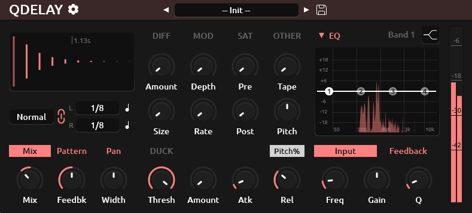

<h1 align="center">
  <!--  -->
  QDelay
  <br>
</h1>
<div align="center">

[](https://github.com/tiagolr/qdelay/releases)
[](https://github.com/tiagolr/qdelay/releases)
[](https://github.com/tiagolr/qdelay/releases)

</div>
<div align="center">

[](https://github.com/tiagolr/qdelay/releases/latest)


</div>

**QDelay** (short for quick-delay) is a dual-delay with more features than it should for a free plugin that's supposed to be quick. While it offers nothing groundbreaking it is based on many popular units like *ReplikaXT* and *EchoBoy*. The main goal is to create a free and open plug-in for my own productions, an alternative to the popular [Deelay](https://sixthsample.com/deelay/) by *SixthSample* without premium versions or trimmed features or on-line activation.

<div align="center">



</div>

## Features

  * **Stereo Dual Delay** with independent delay times and multiple modes.
  * **Ping-Pong mode** with feedback width control.
  * **Tap mode** with offset time (tap) and delay time.
  * **Swing and Feel** offset.
  * **Accent** odd or even taps.
  * **Parametric EQ** on feedback and input signal.
  * **Diffusion** on pre or post delay signal.
  * **Modulation** of delay line time.
  * **Pitch Shifter** on the feedback or post delay signal.
  * **Saturation** on pre and post delay signal (optionally on Feedback path).
  * **Color, Bias and Dynamics** controls for saturation.
  * **Ducking** to muffle the delayed signal on input.
  * **Tape wow and flutter** to add tone variation.
  * **Taps preview** display.

## Download

* [Download latest release](https://github.com/tiagolr/qdelay/releases)
* Current builds include VST3 for Windows, VST3 and LV2 for Linux and AU and VST3 for macOS.

## About

**QDelay** [started as a JSFX](https://github.com/tiagolr/tilr_jsfx?tab=readme-ov-file#qdelay) a few years ago to have a quick delay with basic features like Ping-Pong, cutoff and pitch shift. Like other plug-ins I've rebuilt, the goal is to make an improved version using better tools with better visuals, performance etc.

I decided to build a plug-in that could come somewhat close to EchoBoy in terms of capabilities, the result is good enough but probably nowhere near the quality of Saturations or Tape emulations that SoundToys and Native Instruments engineers can achieve. The distortion unit is based of [JClones TapeHead](https://github.com/JClones/JSFXClones/blob/master/JClones_TapeHead.md) - an open JSFX tape like distortion.

For the pitch shift, I couldn't find many solutions for a zero latency pitch shift that I could adapt to this project, so I went with what I know and ported Saike's [Pitch_Shift](https://github.com/JoepVanlier/JSFX/blob/master/Basics/Saike_Pitch_Shift.jsfx) library from JSFX to c++ and JUCE. The result is surprisingly good and it's impressive the number of people looking for a solution like this in JUCE forums and other places.

Delay swing is implemented using serial delay lines with different times and Feel/Offset is implemented in a hacky way by shifting the write position of the input in relation to the feedback with some extra care to pick the leading write to override the circular buffer while the trailing write overdubs the existing contents.

Tape Flutter and Wow, is taken from ChowDSP [AnalogTapeModel](https://github.com/jatinchowdhury18/AnalogTapeModel).

For future work things can be added like multiple taps per delay like EchoBoy or Valhalla delay, better saturations and more delay modes.

Feel free to explore the repository for snippets on parametric EQs, envelope followers, pitch shifting etc.. or most likely just download the plug-in and have fun with it.

## Tips

Current signal routing:

```
Input > EQ Input > Saturation Pre > Diffusion Pre >
[Delay <-> Modulation <-> EQ Feedback <-> Pitch Feedback <-> Saturation Feedback] >
Pitch Post > Tape Wow/Flutter > Saturation Post > Diffusion Post > Output
```

* Diffusion and Pitch shift can be configured to be Pre|Post or Feedback|Post in the settings menu.
* Saturation can run on the feedback loop for analog tape distortion, with caution, it adds energy each feedback pass.
* In **Tap** mode the first time controls the offset (tap), the second is the delay time.
* **Feel** control offsets the whole delay line by max 1/16 note.
* **Bias** control in Saturation tab shifts the saturation curve creating odd harmonics.
* **Dynamics** control in Saturation tab makes louder hits harder and quieter softer.

## MacOS

Because the builds are unsigned you may have to run the following commands:

```bash
sudo xattr -dr com.apple.quarantine /path/to/your/plugins/QDelay.component
sudo xattr -dr com.apple.quarantine /path/to/your/plugins/Qdelay.vst3
sudo xattr -dr com.apple.quarantine /path/to/your/plugins/Qdelay.lv2
```

The commands above will recursively remove the quarantine flag from the plug-ins.

## Build

```bash
git clone --recurse-submodules https://github.com/tiagolr/qdelay.git

# windows
cmake -G "Visual Studio 17 2022" -DCMAKE_BUILD_TYPE=Release -S . -B ./build

# linux
sudo apt update
sudo apt-get install libx11-dev libfreetype-dev libfontconfig1-dev libasound2-dev libxrandr-dev libxinerama-dev libxcursor-dev
cmake -G "Unix Makefiles" -DCMAKE_BUILD_TYPE=Release -S . -B ./build
cmake --build ./build --config Release

# macOS
cmake -G "Unix Makefiles" -DCMAKE_BUILD_TYPE=Release -DCMAKE_OSX_ARCHITECTURES="x86_64;arm64" -S . -B ./build
cmake --build ./build --config Release
```
